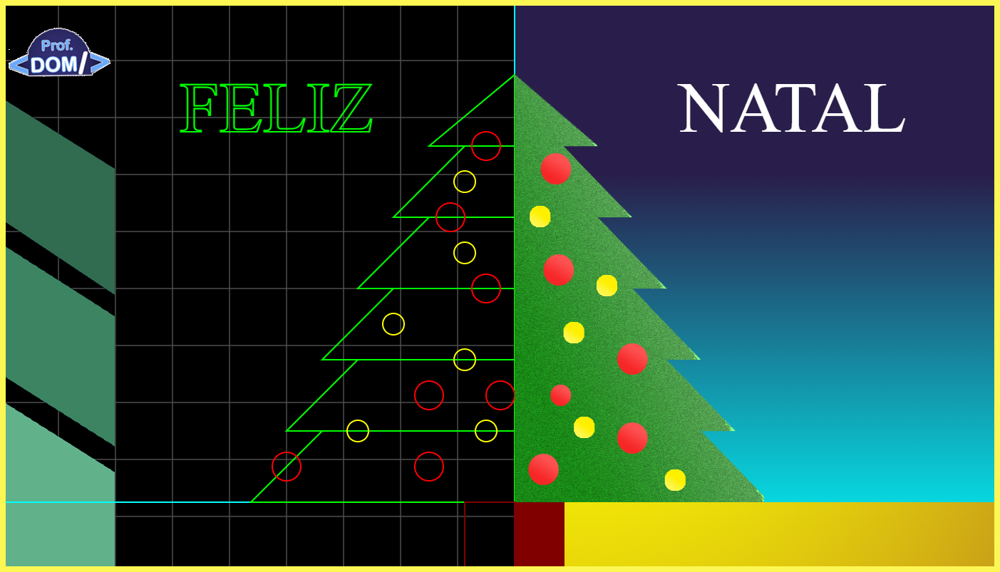

# CARTÃO DE NATAL 2024

Desenvolvendo um simples cartão de natal com programação via javascript e o elemnto canvas do Html 5. 

<figure>
 
 <figcaption>Modelo final do Cartão de Natal 2024</figcaption> 
</figure>

## TECNOLOGIAS
- Javascript
- Canvas Html 5

## STEPS
- 1º  Desenhando a Side Image do Prof. DOM.
- 2º  Desenhando o gride no canvas.
- 3º  Desenhando as linhas guias para a altura da Pinheiro.
- 4º  Desenhando o lado esquerdo do Pinheiro (Wireframe).
- 5º  Desenhando o lado direito do Pinheiro (2D).
- 6º  Desenhando a Sprite do Pinheiro (2D).
- 7º  Desenhando as bolas de natal no Pinheiro (Wireframe).
- 8º  Desenhando o céu.
- 9º  Desenhando o chão e o tronco do pinheiro.
- 10º Desenhando os textos "FELIZ"(Wireframe) "NATAL" (2D).
